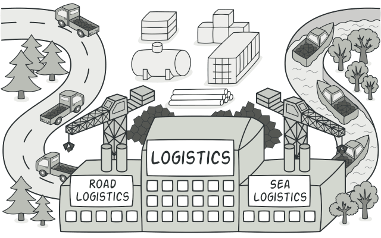
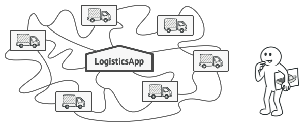

# Factory Method
## Định nghĩa
**Factory Method** là một mẫu thiết kế thuộc nhóm **Creational Patterns**, cung cấp một giao diện để tạo đối tượng trong lớp cha nhưng cho phép các lớp con thay đổi kiểu đối tượng sẽ được tạo ra. Điều này giúp tách biệt logic khởi tạo đối tượng với phần mã sử dụng đối tượng, giúp mã nguồn linh hoạt hơn và dễ mở rộng.

## Vấn đề

Hãy tưởng tượng bạn đang phát triển một ứng dụng quản lý vận tải. Phiên bản đầu tiên của ứng dụng chỉ hỗ trợ vận chuyển bằng xe tải, vì vậy hầu hết mã nguồn của bạn nằm trong lớp `Truck`.

Sau một thời gian, ứng dụng trở nên phổ biến, và bạn nhận được nhiều yêu cầu từ các công ty vận tải biển để tích hợp phương tiện tàu biển vào ứng dụng. 

Tin tuyệt vời, phải không? Nhưng còn mã nguồn thì sao? Hiện tại, hầu hết mã nguồn của bạn đang bị ràng buộc với lớp `Truck`. Nếu thêm `Ships` vào ứng dụng, bạn sẽ phải sửa đổi toàn bộ mã nguồn. Hơn nữa, nếu sau này bạn quyết định bổ sung thêm một loại phương tiện vận chuyển khác, bạn có thể sẽ phải thực hiện tất cả những thay đổi này một lần nữa.

Kết quả là, bạn sẽ có một mã nguồn khá lộn xộn, đầy rẫy các câu lệnh điều kiện để thay đổi hành vi của ứng dụng dựa trên loại đối tượng phương tiện vận chuyển.